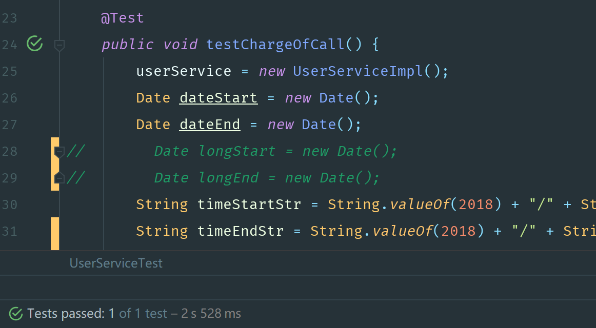
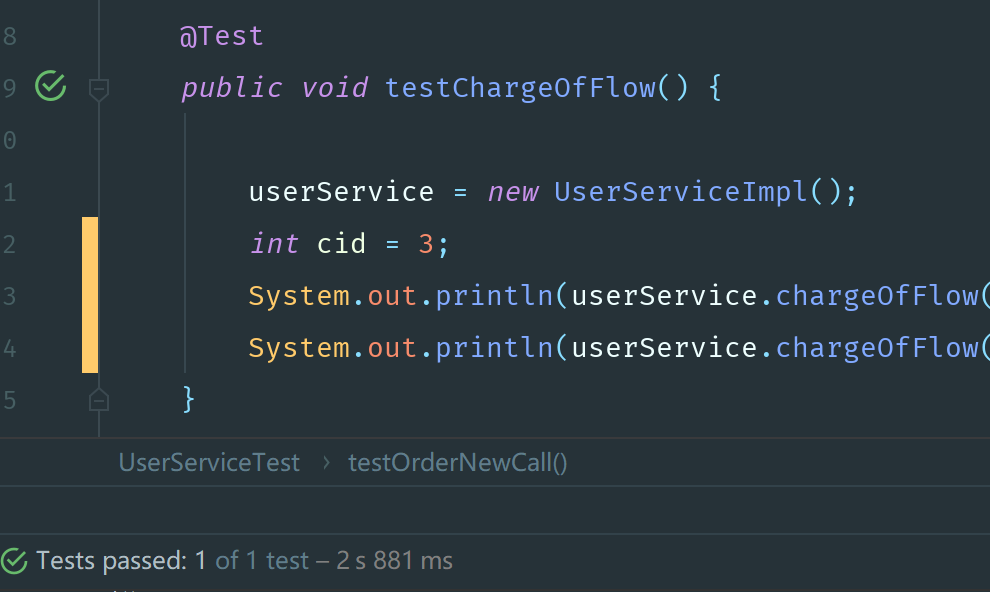
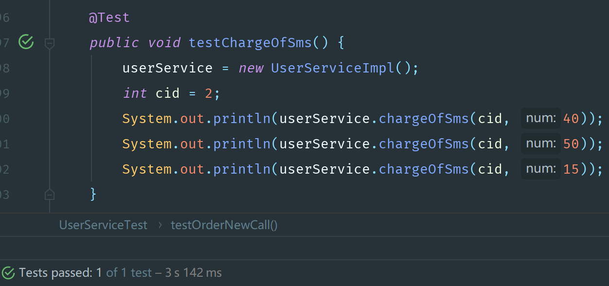
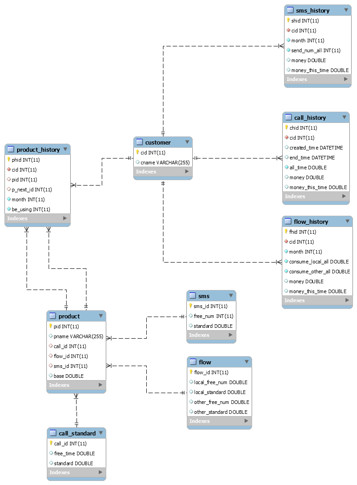

# sqlDesign说明文档

## 数据库设计-移动运营商业务数据库设计与实现

## 操作

1. 对某个用户所有套餐的查询，2s441ms

2. 订购套餐立即生效，2s838ms

3. 订购套餐下月生效，2s308ms

4. 取消套餐立即生效，2s460ms

5. 取消套餐下月生效，2s472ms

6. 一次通话资费生成，2s528ms

7. 流量资费生成，2s881ms

8. 短信资费生成，3s142ms

## 优化方案

1. 没有利用数据库本身的函数如sum, max等，用Java逻辑操作大大增加了时间复杂度

2. 没有加入索引，导致查询和更新速度较慢

3. 可能对现实中操作的复杂缺乏足够考虑，可能有与现实预期偏差的情况

4. 在设计中因为对资费问题的考虑不周，导致为了实现方便在多个资费记录表中多加了名为money_this_time的column，与之间money的column有功能重合和数据冗余之处，可以改进为只记录当次消费

5. 数据库不符合BCNF，可以进一步优化减少冗余信息

## 数据库ER图

 ER图
 